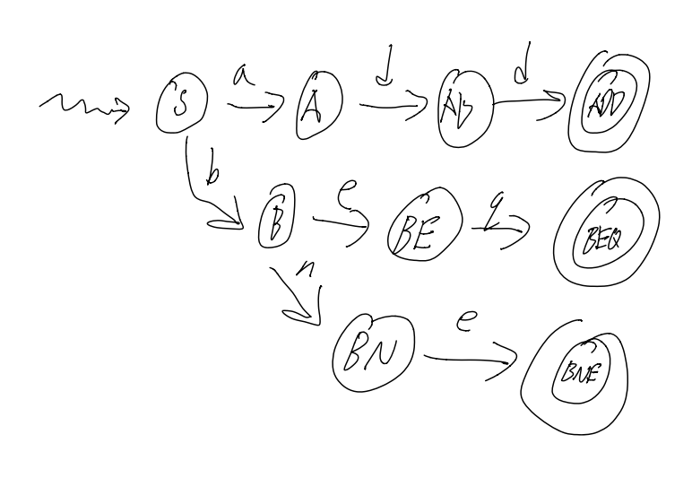
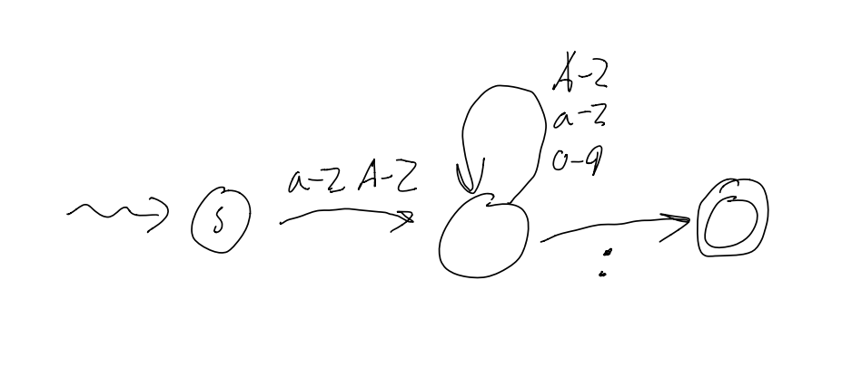
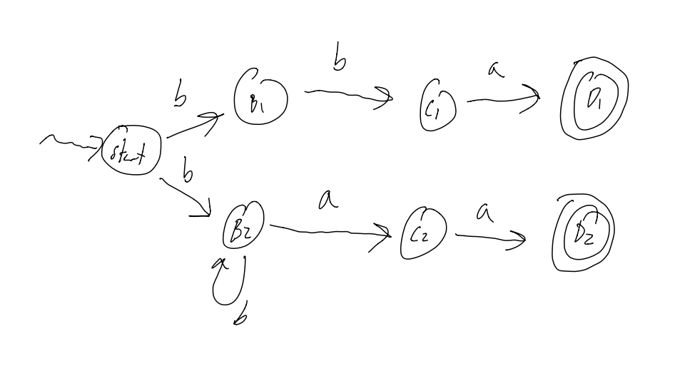
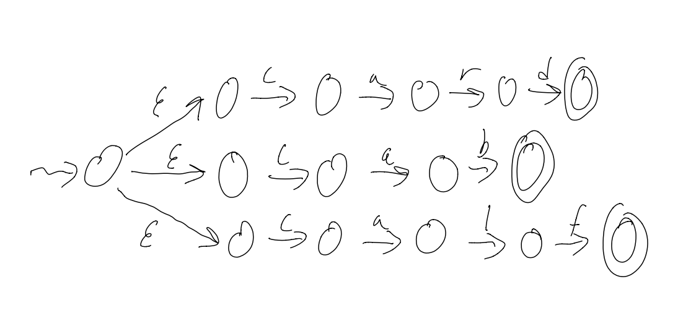
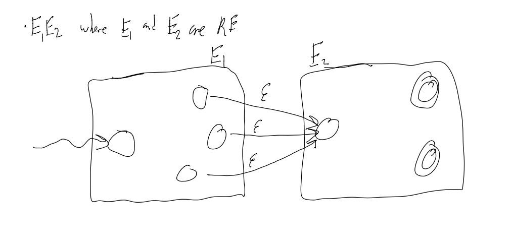
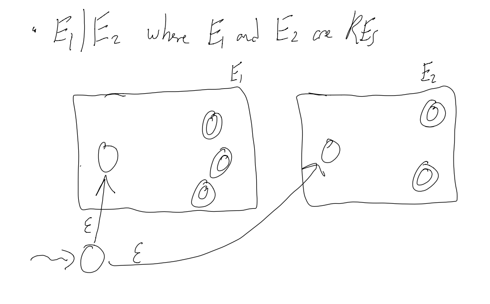
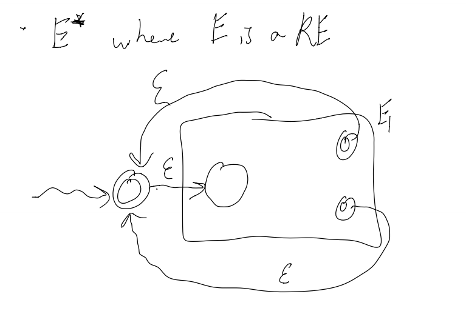
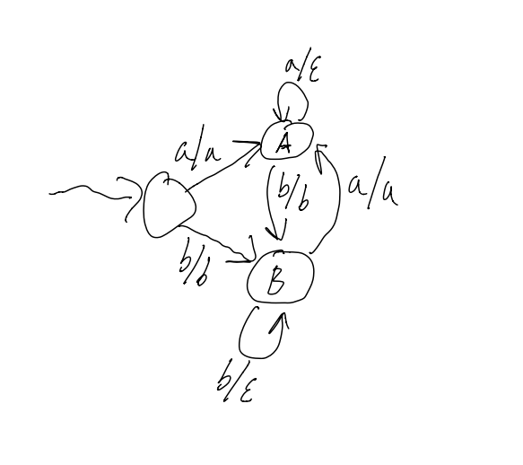

<script>
(function(i, s, o, g, r, a, m) {
    i['GoogleAnalyticsObject'] = r;
    i[r] = i[r] || function() {
        (i[r].q = i[r].q || []).push(arguments)
    }, i[r].l = 1 * new Date();
    a = s.createElement(o),
        m = s.getElementsByTagName(o)[0];
    a.async = 1;
    a.src = g;
    m.parentNode.insertBefore(a, m)
})(window, document, 'script', '//www.google-analytics.com/analytics.js', 'ga');

ga('create', 'UA-58621690-1', 'auto');
ga('send', 'pageview');
</script>

# CS-241 - Foundation of Sequential Programs
## Fall 2016
### Notes by Daniel Prilik - SE 2020

## DISCLAIMER

These notes are **far from complete** and are **quite porous** compared to what's been covered in class.
Copying code and diagrams off of powerpoints is hard in and of itself, but when the powerpoint slides start flying by, it becomes an impossible task.
Use these as a super rough outline of what we may have possibly covered in class, but **do not use these as a primary set of study notes.**

That said, the section regarding **Formal Languages** might be more complete.

Yours, 
\- Daniel Prilik

[TOC]

# Instructor info
- Matt Crane
	- Email: matt.crane@uwaterloo.ca
	- Office Hours: DC2555F 3:00 - 4:00pm Tues / Thurs
- Troy Vasiga
	- Email: troy.vasiga@uwaterloo.ca
	- Office Hours: DC3112 12:00 - 1:30pm Tues / Thurs
- ISA: Max Bardakov 
    - Email: cs241@uwaterloo.ca

# Lecture 1

Oh boy! Here we go again!

## Bookeeping

The course website is www.student.cs.uwaterloo.ca/~cs241/
- Syllabus
- Announcements
- Everyhing else!

A note about Assignments:
- Start early!
- Don't fall behind!
- In total, there are 10 assignments, each with ~9 subparts, so ~100 things to submit

The course uses our favorite program: _Marmoset!_
- This time around though, there are Release Tokens, that give you 3 attempts per 12h to test your programs

Marking breakdown:
- 25% Assignments - Due Thursdays at 7:00pm
- 25% Midterm - Wed Oct. 26th from 7:00-8:50pm
- 50% Final (must pass) - 2.5h sometime in December

## Idyllic Intro

So what is the purpose of this course:
- To learn
- To Meta-think
- To write a program, that reads a program, that outputs a program.
	- Inception. BWUHHH

By the end of this course, we will know what _really_ happens when you compile and run a program, and there will be little to no mystery about what happens when you run a program.

## Technical Intro

In this course, all a computer is a **CPU** and **RAM**.

A CPU **Controls and Manipulates the Data**, and the RAM is just a bunch of **addressed "boxes" that store Data**.

## Binary Data

All data is at a basic level is a sequence of 1s and 0s, or Bits

There are many interpretations for what a specific sequence of bits means (i.e: numbers, ascii, etc...), and there is no one "correct" interpretation.

## Machine Language

There are certain sequences of bits that do in-fact have one specific meaning, or at least they do when it comes to how the machine interprets them. Depending on the Achitecture of the machine (i.e: Intel/Motorola, 32/64bit, etc...) there may be different bit sequences that mean the same things.

These codes are great for machines, super easy, just 0 = off, 1 = off, but they SUCKS for humans.

## Assembly 

**Assembly** on the other hand, sucks less for Humans.

It is a simple, textual representation of machine language. It is more human readable, and makes development less, shall we say, absolutely terrible.

A big plus of assembly is that is it pretty easy to translate Assembly to Machine Code. Assembly is just an _Abstraction_.

## Assembler
The **Assembler** is the program that preforms the translation from Assembly to Machine Code. 

## Back to the Basics: Bits

What is a Bit exactly?

Well, it is just a value that can have 2 states, either 1, or 0. That's it.

The nice thing is that a **sequence of bits** can describle a lot of different value.
- 2 bits can have 4 arrangements
- 3 bits can have 8 arrangements
- n bits can have 2^n arrangements!

We can use Bits to describle certain useful "types":

### Integers

#### Unsigned integers
Each sequence is just a direct representation of a number in base 2.

#### Two's Compliment
What if we want Negative Numbers? Well, then we have to use a more complicated code, called 2s compliemnt.

To get 2s compliemnt, we
1. write the absolute value of a number in banary
2. Negate the bits (to get 1s compliment)
3. Add 1

**So, With 3 bits, we can have the following interpretations for integers...** 

Binary | Decimal | 2's compliment
-----|----- | ------
`000` | 0 | 0
`001` | 1 | 1
`010` | 2 | 2
`011` | 3 | 3 
`100` | 4 | -4
`101` | 5 | -3
`110` | 6 | -2
`111` | 7 | -1

** Notice that in 2s compliment, the left-most bit tells us if it is negative or not...

To hammer in this point, consider `1010`.
What does it mean?
Well, nothing really, not until we know what type is should represent.
It is `10` if it's an unsigned number, but it's `-6` in 2s compliment 

#### Characters
Typically represented with **8 Bits**

Eg: `00001010` is `\n` in ASCII (use the linux command `man ascii` for a full table)

## Hexadecimal

In general, binary SUCKS to work with. Hexadecimal sucks less.

Essentially, we can represent numbers with 16 symbols, instead of just 1 and 0

We use the digits 0-9, A, B, C, D, E, and F.

A nice property of Hexadecimal is that it is easy to convert into Binary, and vice versa.
You just split the binary number into chunks of 4 bits, and then write the digit associated with each chunk.

Eg: `1010 1111 1001 1001` = `xAF99`

# Lecture 2

## Grouping of Bits

The most common grouping of bits is in a **byte**, or a group of **8 bits**

There are **256** possible values that can be encoded by 8 bits. What to encode however, is up to interpretation (see above)

## Files

Files are just long sequences of bytes, and it is up to a program to determine what the byte sequences actually mean.

The command `cat` for example, will interpret any file thrown at it as Text, and print out each byte as a ASCII char.

The command `xxd` on the other hand, will print the file's bits as hexadecimal values (alongside an ascii interpretation of the bits)

So, for example, if there is a file `hasY` with string `Y\n`, then the output of `xxd` would be something like:

```
#Addr     #Hex   #Ascii
00000000: 590a   Y.
```

`59` is the hex code for `Y` in ascii, and `0a` is the hex code for the Newline Char in ascii

## Words

A **Word** is a grouping a bits that a specific CPU "likes" (i.e: can easily do math on, execute ops, etc...)

Words can be any number of bits... from **8 bit** in the 80s, all the way to **64 bit** nowadays.

NOTE: a CPU's specific word-size will limit the total ammount of memory a CPU can ever see! For example, 32 bit CPUs could only address ~3.5gigs of memory, so until the switch to 64 bit CPUS, no matter how much RAM you shoved in a PC, if the OS was 32bit, it couldn't see more than 3.5gigs

## Our Machine

The machine we are using in cs241 is a **Stored Program Computer**

What this means is that the CPU is connected to the Memory (via a "mem bus") not just to use the memory as a place to store data, but also as a place to store actual program code.

To run a program, the CPU calls the memory for an instruction, and the memory returns a string of bits that (should) correspond to a instruction that the CPU can execute.

## CPU

CPUs are not actually just magic boxes. They have things within them that make them work...

There are several places to Store things
- **Program Counter (PC)**- Where in memory to load new instructions from
- **Instruction Register (IR)**- Chunk of memory that holds the instruction to run
- **Registers 0-31 (\$0 -> $31)** - "boxes" that can store words of information (think superfast ram)

And there are other places that Do things
- **Control Unit** - reads the PC, retrieves the instruction from memory, puts that instruction in the IR, and then executes the instruction
- **Arithmetic Logic Unit (ALU)** - Can do maths on given bits. Things like adding, subtracting, AND / OR / NOTs, etc...

## Memory (RAM)

RAM is really just a giant block of "boxes" that can store bytes, starting from 0 to denote the 1st byte, 4 to denote the 5th byte, etc...

On a MIPS machine, words are 4 bytes, and as such, when addressing the RAM to ask for instructions, we must ask for words, so we address RAM in increments of 4.

## MIPS

MIPS is a set of instructions that our processor understands. 

In this course, there are **18** different ** 32-bit (4 byte)** instructions encoded in 2 basic instruction formats.

**MIPS assembler** is the **Assembly Language** that translates human-readable instructions into the actual 32-bit / 1 word instructions that the CPU can read.

For example:
- `add $1, $2, $3` are **MIPS instructions** that correspond to...
- `0000 0000 0100 0011 0000 1000 0010 0000` when converted to **Binary**, or 
- `0x00430820` when written in **Hex**

That binary actually means the following...
```
000000      ; Call the ALU
00010       ; $2
00011       ; $3
00001       ; $1
00000100000 ; Add
```

A full list of MIPS instructions can be found here: https://www.student.cs.uwaterloo.ca/~cs241/mips/mipsref.pdf

## Loading and Storing values to / from RAM

The instruction `lw` loads a word from memory, and `sw` stores a word to memory

Eg: `lw $7, 0($3)` will load the value at MEM[\$3] into register \$7
Eg: `sw $8, 4($3)` will load the value from \$8 to MEM[\$3+4] (that +4 is needed since we store Words in memory, and Words are 4 bytes each)

## Main Machine Cycle

Every single clock cycle, the following happens:

1) Fetch a word from RAM whose address is in the PC (the PC is initialized to 0 on power-on)
2) Place that word in the IR
3) Increment the PC by 4
4) Decode and Execute the instruction that is in the IR

# Lecture 3

## Special Registers

Register | Description
--- | ---
`$0`  | Constant **value 0**
`$29 and $30` | **Stack** (see below...)
`$31` | The **Return Address (RA)**

## Assembly Code

There is a 1 to 1 correspondance b/w Assembly Language and Machine Language. It translates human-friendlier mnemonic instructions like `add $3, $1, $2` to their related bit form. The **Assembler** is the program that does this automatic translation.

For some example of Assembly Code and the Machine Language equivilents, see the cs241 website.

# Lecture 4

## Labels

Labels identify an address.

```language
; some stuff

loop: add ...
; more instructions...
bne $2, $0, loop ;using label

X: Y: ; can have 2 labels on the same line

```

## Storing and Restoring Registers

What happens if we call a subroutine where it uses some registers, that you need! We only have $32 registers after all!

Consider this example below

```
; Example 6a: Calling a procedure
sw $31, −4($30)		; save $31 on stack
lis $31
.word 4
sub $30, $30, $31
lis $1 				; call sumOneToN(13)
.word sumOneToN
lis $2
.word 13
jalr $1
lis $31				; restore $31 from stack
.word 4
add $30, $30, $31
lw $31, −4($30)
jr $31 				; return to OS

;------------------------

; Example 6b: A procedure
; sumOneToN: sum the integers from 1 to N
; input: $2 is N
; output: $3 is the sum

sumOneToN:
sw $1, −4($30) 		; save $1 on stack
sw $2, −8($30) 		; save $2 on stack
lis $1
.word 8
sub $30, $30, $1
add $3, $0, $0 		; clear $3
beginLoop:
add $3, $3, $2 		; add $2 to $3
lis $1 				; decrement $2
.word −1
add $2, $2, $1
bne $2, $0, beginLoop
lis $1
.word 8
add $30, $30, $1
lw $1, −4($30) 		; restore $1 from stack
lw $2, −8($30) 		; restore $2 from stack
jr $31 				; return from sumOneToN

```

In general, Stack usage rules are:

```
sw
sw
...
sub $30, $30, 4.n
[body]
add $30, $30, 4.n
lw
lw
jr $31
```

## Recursion

Here is an example of recursion

```Assembly
; Save $31 on the stack
sw $31, -4($30)
lis $31
.word 4
sub $30, $30, $31

; Call recSum(13)
lis $4
.word recSum
lis $1
.word 13
jalr $4

; Restore $31 from the stack
lis $31
.word 4
add $30, $30, $31
lw $31, -4($30)

; Return to OS
jr $31

;-----------------------

; recursively sum up the integers from 1 to N
; assume that input (N) is in $1
; output is returned in $3
recSum:
; Save registers on the stack
sw $1, -4($30)
sw $2, -8($30)
sw $4, -12($30)
sw $31, -16($30)
lis $4
.word 16
sub $30, $30, $4
; Initialize sum so far
add $3, $0, $0
; Check to see if we are in the base case (N=0)
beq $1, $0, done
; Otherwise, we must compute the sum of the current N
; and the sum of the rest
; keep a copy of the current value of N
add $2, $1, $0
; put N-1 into register $1
lis $4
.word 1
sub $1, $1, $4
; get ready to call routine (i.e., ourself)
lis $4
.word recSum
jalr $4
; add the value we got back to the current value of N (in $2)
add $3, $3, $2
done:
; restore registers
lis $4
.word 16
add $30, $30, $4
lw $1, -4($30)
lw $2, -8($30)
lw $4, -12($30)
lw $31, -16($30)
jr $31
```

In general, the template for recursion in MIPS is roughly:

- Save registers ($31 in particular)
- Check base case
- Recursive case:
	- Compute next value
	- Call self
	- Compute return value
- Restore registers

# Lectures 5

## Assembler Stages

First pass = make an intermediate representation
Second pass = make actual ML code

## Syntax and Semantics

**Syntax** = form / structure (col 2 of MIPS ref sheet)
Asm lang syntax goes in, ML lang syntax comes out

**Semantics** = "meaning" (col 3 of MIPS ref sheet)
What do instructions actually "do"

**Location** and **Labels** (col 4 of MIPS ref sheet)
Location = "where I am"
Label = "where I want to be"

## First Pass - Analysis

Must generate
1) an intermediate representation
2) a symbol table

Tokenization (not neccesary, but probably the best intermediate representation
- A **Tokenizer** is a program that
	- takes an **Input** of ASCII chars
	- **Outputs** a sequence of Tokens
	- e.g: `add $3, $1, $7` => `<ADD><REG><COMMA><REG><COMMA><REG>`

### Intermediate Representation (IR)

There is no "hard and fast" rules for what a IR can be.
It can be anywhere from 
- Just the raw ASCII minus comments
- A series of tekens
- Perliminary binary translation
- Or really anywhere inbetween

### Symbol Table (ST)

Stores the address and the name of each label definition

The following code has the following Symbol table
```
0x00 misery: beq $0, $7, happy
...
0x0C         beq $7, $12, misery
...
0x1C happy:  add $3, $3, $3
```

name | address
-- | --
misery | 0x00
happy | 0x1c

## Second Pass - Synthesis

Takes the IR and ST, and combines them into valid machine code

## Example: Encoding a beq instruction

Given `0x0C beq $7, $12, misery`, and that `misery` is at `0x00`

from the MIPS reference sheet, we know `beq` has format `0001 00ss ssst tttt iiii iiii iiii iiii`, where i is an **Offset** from the current PC!

Thus, we must encode those `i`'s to have a value of `-16`, to move the PC back to 16

## Advice for making an assembler

Look for patterns!

For example: ADD and SUB have instructions that are almost the same! They only differ by 1 bit!

There are plenty of these, so don't forget to write DRY code

## Efficieny of the Symbol Table

For large programs, there will be a huge symbol table, and there must be a way to have quick and efficient access to it.

Symbol Tables are just (key, val) pairs, with the key being the label string, and the value being an integer representing the address of the label

So, TL;DR, use a Hash Map / Dictionary
- Supports quick insert (Pass 1)
- Supports quick remove (not that we will be doing any removes)
- Supports quick finds (Pass 2 AND Pass 1 - Check for same label, 2 addr)

## Error Checking in Pass 1

Check for Duplicate Label Definitions (i.e: same label for 2 different addresses)

Check for Label Syntax
- Must start with an alphabetic char (so 123fred: is bad, $54: is bad)
- Must have only alphanumeric chars

Check basic Syntax
- Eg: `asddsa fgdfg ,,;` is invalid

## Error Checking in Pass 2

Consider `beq $3, $4, notALabel`

We can't jsut throw this instruction out in Pass 1, as notALabel might be defined later. Only in Pass 2 can we throw a "label undefined" error
This is a *Semantic* Error

Consider `lw $3 4($30)`

This will throw a *Syntax* error

Consider `lw $3, 4($30`
Consider `lw lw $3, 4($30)`

These will all throw *Syntax* error

Consider `lv $3, 4($30)`

This will thow either a "invalid instruction" error, or a "Syntax error"

Consider `lw $3, 4($32)`

This will throw a *Semantic* error, since register $32 doesn't exist

Consider `lw $3, 44444444444444($30)`

This will throw a *Semantic* error, since that number is out of the 16 bit bound, and can't be encoded in the instruction

Consider `$3, 5($30)`

This might throw a *Semantic* error, since 5 is not a multiple of 4 (but i might not, if the multiplication between $30 and 5 is actuall a multiple of 4)

## Error Checking Philosophy

### Accept valid instructions, reject everything else.

Easier to check validity of instruction, than the invalidity of the instructions.

## A note on what the Assembler will output

The assembeler we write will **output literal bits, NOT ASCII chars!!**

That means that the assembler will make heavy use of the bitwise operators, like `&, |, <<, >>`, etc...

Output is still to STDOUT, but use `putchar`

## A Gift

On the Assignment 3/4 page, you can download `asm.c / asm.cc / asm.rkt`, that will provide a significant ammount of helpful boilerplate code to jumpstart your assembler development.

## How to Write an Assembler

Slowly.

With a lot of tests.
Like, a LOT of tests.
Like a SHITTON of tests.
Like an UNREASONABLE AMMOUT of tests.

Test your assembler against cs241.binasm.

## Correctness

- Read the spec carefully, or, RTFM
- Think reasonably, and unreasonably
- Remember memory: O(n)
- Running times DO matter: O(n)
- *Dont't use Marmoset as your only testing tool!*

# Lecture 6

## Loaders

Generally, we don't run our programs by loading them at addr. 0. Usually, we have an OS loaded before us that then
a) delegates RAM to programs, 
b) copies those programs to that point in ram, 
c) executes them.

In pseudocode, the loader does the following:
```
loop
 decide what program to run
 figure out the length of the program (n)
 find n words of storage at some address (a)
 read program into memory at a
 set up program (e.g: mipstwoints)
 put a into a register (say $19)
 jalr $19
end loop
```

## Chickens and Eggs

To get the size of the program we want to load, we actually have to store the size of our program with our program (this is because of the chicken and egg problem of having to load a program into RAM to find it's size, but we need it's size to load it into RAM)

Another issue is that the loader itself is a program, so who loads the loader?
Well, a Microloader loads the loader.
Who loads the Microloader?
The Firmware / BIOS

It's turtles all the way down.

(this is called Bootstrapping)

### NOTE
I missed the next bit of the lecture, so get ready for some pretty disjointed notes.

## MERL Format

Header cookie (1 word: `beq $0, $0, 2 (0x10000002)`)
Length of the .merl file (1 word)
Length of program + header (1 word)
Program code (A3 + A4)
Notes of what to change (Relocation entries: `.word 1` `.word <loc>`)
\- i.e: which registers link to other registers that would have to have a mem-offset added to them

See full description on the CS241 website

## A MERL Assembler (for A5)

- Pass 1 changes
	- Start counting at 0xc to account for the 3 word MERL header
	- If you see a `.word <label>` instruction, write down it's location in the relocation table
- Pass 2 changes
	- Output the header (the coockie, the size of the .merl file, the size of the program + header)
	- Output notes:
		- Relocation table entries

## Relocating Loader Pseudocode

```
read header
a = findFreeRAM(codeLength)
for each instruction:
	MEM[a + i] = instruction
for each relocation entry
	MEM[a + location] += a
place a into $19
jalr $19
```

# Lecture 7

## MERL file for example code

**Code**
```
A: .word B
B: .word 7
C: .word 0xA
D: .word C
```

**Symbol Table**
Symbol | Address
----|----
A | 0x0C
B | 0x10
C | 0x14
D | 0x18

**Relocation Table**

|Relocations |
|---------- |
|0x0C|
|0x18|

**The Merl File:**
```
; Header
0x10000002
0x0000002C
0x0000001C

; Program Code
0x00000010
0x00000007
0x0000000A
0x00000014

; Relocation Entries
0x00000001
0x0000000C
0x00000001
0x00000018
```

## Linkers

Linkers take distinct programs, and smush them together into one package.
This is useful to create reusable components of code, and allow other code to to them.

https://www.student.cs.uwaterloo.ca/~cs241/slides/LinkerHandout.pdf

https://www.student.cs.uwaterloo.ca/~cs241/slides/LoaderHandout.pdf

## Missed a lot about ESD and ESRs

## Linker Pseudocode
```
concatenate the (merl) programs
construct the ESD
use ESR
Relocate (internally)
```

# Lecture 8

## Static Linking vs Dynamic Linking

Static Linking Example
- Assemble and combine all code into one large, self contained, executable

Dynamic linking example
- Done at execution time
- Essentially, you call a "system subroutine" with the argument being a string of the subroutine you actually want to find, and the system will then redirect you to the code you want.
- Results in smaller file-sizes
- Multiple programs reuse the same subroutines


That's all for MIPS btw

***

# An Introduction to Formal Languages

## Motivation

- Precision of specification and recognition
- Importance of this: every assignment past A5 will use these concepts
- Benefits of theory:
	- Means ofcommunication
	- Determine the power and limits of communication (what we can / can't express)
	- Guides the design and structure of a compiler

## Terminology

- Rooted in set theory `{}`
- Alphabet: a finite set of symbols
  $ \Sigma_1 = \{a, b, c\} $
  $ \Sigma_2 = \{\Delta, cat, blue, 123\} $
- Word (aka strin, sentance): a finite sequence of symbols from the alphabet
	- Words over $\Sigma_1: W_1=baab\ \ W_2 = aaa\ \ W_3=\epsilon(or \lambda)$
	- Note that no symbols is totally okay.

- Language: a set of words
	- Languages over $\Sigma_1:$
		- $ L_1 = \{a,aa,aab,baa\}$
		- $ L_2 = \{a,aa,aaa,aaaa,...\}$
		- $ L_3 = \{\}$
		- $ L_4 = \{\epsilon\}$
- $|W|$: the size of $W$ (Where $W$ is a word or language)
	- $ |L_1| $ = 4
	- $ |L_2| $ = infinite
	- $ |L_3| $ = 0
	- $ |L_4| $ = 1
	- $ |W_1|\ (baab) $ = 4

## Use of Formal Languages Specification

A statement of what a language is should be
- precise (no ambiguity)
- easy to express
- Automatable

We can use these specifications to Determine if a word is in a language
- Formally: given language $L$ and a word $w$, recognition answers the question: "$is\ w \in L$"
    - Techincally, this is just a Yes or No question, but in practice, we would like some info about what went wrong
    - Eg: if NO: line # and type of error, if YES: certificate of correctness


## WLP4

Let's formally specify WLP4 "WooL P Four" = "Waterloo, Language, Plus, Pointers, Plus, Procedures"

- Alphabet: WLP4 tokens
- Word: A WLP4 program
- Language: Set of calid WLP4 programs

There is a full language specification the main course web-page: https://www.student.cs.uwaterloo.ca/~cs241/wlp4/WLP4.html

## Language Classes
Language classes are sets of languages that may share common characteristics

- Chomsky Hierarchy for Languages (n+1 encompases n):
	- Finite Languages (fixed number of words)
	- Regular Languages (a, aa, aaa, aaa...)
	- Context-free Languages (explained later)
	- Context-sensitive Languages (explained later)

As we move down the chompsky hierarchy, we move up in power of expressiveness, but also complexity

## Use of Formal Languages - Organization of Compilation

- **Lexical analysis** - Regular Languages
- **Syntaxtic analysis** - Context Free Langauges
- **Context-sensitive analysis (semantic analysis)** - Context Sensitive Languages
- **Synthesis (code generation)** - Context Sensitive Languages

## Which Language Level is it?

- Let $\Sigma = \{ASCII\ characters\} - \{CR\}$
- $L_1 = \{$0, $1, $2, ... $31\}$ &nbsp;
 	- **Finite Language**
- $L_2 = $ valid labels in MIPS 
	- **Regular Language**
- $L_3 = \{0,4,-4,8,-8,...\} = $ valid load word (`lw`) offsets
	- **Finite Language** (offsets have bounds)
- $L_4 = $ valid line of assembly language for A3P2 (`.word <int>` or `.word <hexint>`)
	- **Finite Language** (ints/hexints have bounds)
- $L_5 = $ valid line of assembly language for A3P3 (+`.word <label>`)
	- **Context Sensitive** (validity depends on if label is defined)

# Lecture 9

## Specifying Regular Languages

There are several basic building blocks that we use to specify Regular Languages:

### Finite languages
You can always build off an existing finite language

### Union
Formally Defined: $T_1 \cup T_2 = \{x\ |\ x \in T_1\ or\ x \in T_2\}$
Simply: Make a new set containing all the elements of both sets (with each element appearing only once)

### Concatenation
Formally Defined: $T_1 \cdot T_2 = \{xy\ |\ x \in T_1 and\ y \in T_2\}$
Example: 
$T_1 $= {dog, cat}
$T_2 $= {$\epsilon$, fish}
$T_1 \cdot T_2$ = {dogfish, catfish, dog, cat}

$T_1$ = {dog, cat}
$T_2$ = {}
$T_1 \cdot T_2$ = {}

### Repetition
Formally Defined Recursively (Kleene closure): 
$T* = \{\epsilon\} \cup \{xy\ |\ x \in T*\ and\ y \in T\}$
Alternate Definition (Iterative):
$T^0 = \{\epsilon\},\ T^1 = T,\ T^2 = T \cdot T^1 = \{xy\ |\ x \in T and\ y \in T^1\}$
(In general): $T^k = T \cdot T^{k-1}$

Examples: 
$T = T^1 = $ {dog, cat}
$T*$ = {$\epsilon$, dog, cat, catdog, dogcat, dogdog, catcat, dogdogcat, ...}

## DFAs (Deterministic Finite Automata)
Regular Languages can be recognized by _Finite Automota_
We begin with _deterministic finite state automata (DFAs)_

DFAs must have the following:

- States (at least one)
    - Start State (ONLY 1)
    - Final State(s) (MUST HAVE MIN 1)
    	- after reading all input, if I am in a final state => accept
- Transitions (optional - eg: no transitions with 1 state)
	- if in `state A` AND read input $x \in \Sigma$ => move to `state B`

_A DFA for some MIPS instruction_

_A DFA for a label (i.e: starts with letter, then any numberletter or number)_

**Images courtesy of Stephen Melinyshyn**

### Observations about DFAs
- Ability to trace
	- can draw a picture (only ever in one state)
- Transitions out of states are unique and deterministic
- Errors -> implicit error state (if input is not specified in a transition of a state, then that is an error)

## Formal Definition of DFAs

- A DFA is a 5-tuple $(\Sigma, Q, q_0, A, \delta)$
	- Finite Alphabet $\Sigma$
	- Finite set of States $Q$
	- Start State $q_0 \in Q$
	- Set of final/accepting states $A \subseteq Q$
	- Transition function $\delta : Q\ x\ \Sigma \to Q$

## DFA Interpreter Algorithm

Input: A word $w = w_1w_2...w_n$ where each $w_i \in \Sigma$
Output: `true` if accepter, `false` if rejected

```
state = q0
for i in 1..n:
	state = delta(state, wi)
return (state in A)
```

## Implementing DFAs
We need to implement the transition function somehow... but how?

Option 1: `if` statements?
```
if state == state1:
	if input == a: ...
    else if input == b: ...
    ...
else if state == state2:
	if input == a: ...
    ...
...
```

**NO. THIS IS A TERRIBLE IDEA.**

Option 2: **Dictionary**: key = (state, input), value = state

## Where are DFAs used?

- Every computer ever
	- a CPU is essentially just a DFA

# Lecture 10

## Non-deterministic Finite Automa (NFAs)

L = {bba, baa, bbaa, bbbaa, bbbbbaa, ...} (wich is either 2 b's followed by an a, or 1 or mote b's bollowed by 2 a's)

If we try to derive this using a DFA, it is pretty unweildy, and grows pretty large. Moreover, it is hard to see what the DFA recognises at a glance... TL;DR: It works, but it's ugly.

On the other hand, if we do this with an NFA, it becomes a lot clearer.



NFAs can be in **2 different states at the same time!**
NFAs allow *multiple transitions out of one state on the same input*

## NFA Definition

It's the same as DFA with the following change: $T:Q\ x\ \Sigma \rightarrow 2^Q$
In english: We can be in a Set of States, and this T is a *relation* instead of a function

2^q^ is the **Powerset** of Q

if Q = {a,b,c} then 2^q^ = { {},{a},{b},{c},{ab},{ac},{bc},{abc} }

Note: |2^Q^| = 2^|Q|^

## NFA interpreter

Input: a Word $w = w_1w_2...w_n$
Output: $True$ if accepted, $False$ if rejected

Pseudocode:
```
states = {q_0}
for i in 1..n:
	states' = {s' | s' in T(s,w_i) for all s in states}
	states = states'
return (states) instersected with (Accepted States) =/= {}
```

Essentially, we have to track an array of possible states we are in. That's all.

## Implementing an NFA interpreter

With C++, we are lucky enough that STL provides us with methods like:
\- Intersection
\- Union
\- Membership
\- Iteration

BUT these are NOT constant time operations.

Luckilly, we can improve preformance by using a **Bit Vector**
i.e: Say we have 8 states, and we have a byte like `10101100`, that means we are currently in sates 3,4,6,8

Using bit vectors lets us use bytewise operations to do intersection, union, etc... but we have to deal with bitshifting :D

## Differences b/w NFAs and DFAs

NFAs can be smaller than DFAs for the same language
NFAs can be in multiple states at the same time
DFAs are easier to implement due to one variable (the current variable)

NOTE: **The two are equivalent in the languages they recognize.**
i.e: you can always write a DFA from an NFA **and you will have to on the midterm**
Also, all DFAs are valid NFAs.

## Killer app for Finite Automa

Scanner = tokenization, and indeed, if you look at the source code given for the asm assignment, you can see an implementation of a tokenizer thant uses DFAs.

## $\epsilon$-NFAs

Allow transitions between states on "no input"
Can be used as "glue" for joining machines together

Example: L = {card, cab, calf}



## Converting $\epsilon$-NFAs to NFAs

Converting a $\epsilon$-NFA to a NFA is always possible.
There are a few ways to do this:
1) take shortcuts: $\epsilon X = X\ for\ X \in \Sigma$
2) Pull back accepting states
3) Remove $\epsilon$-transitions
4) Remove dead states (states that we can never get to)

# Regular Expressions

## Definition

Defined recursively: a Regular Expression (RE) is:
- $\emptyset$, or
- $\epsilon$, or
- $a $ where $a \in \Sigma$, or
- E~1~E~2~ where both are REs, or (concatenation)
- E~1~|E~2~ where both are REs, or (Alternation / Union)
- E* where E is a RE (Repetition)

And there is an Order of Precendence for the last 3:
1) Repetition
2) Concatenation
3) Alternation

## RE examples

L = {cab,car,card}, $\Sigma$= {a,b,c,...z}
We can make a Regex for this langauge in different ways:
-- cab|car|card **or**
-- ca(b|r(d|$\epsilon$))

L = {w | w contains an even number of a's}, $\Sigma$= {a}
-- (aa)*

L = {w | w contains an even number of a's}, $\Sigma$= {a,b}
-- b\*(ab\*ab\*)\*

## Unix Shorthands and Extensions

Most Regex "engines" accept the following shorthands as valid syntax:
\- `[a-z]` translates to a|b|c|...|z (the english alphabet)
\- `E+` translates to `EE*` (1 or more)
\- `E?` translates to `(E|epsilon)` (zero or one)
There are plenty more!

# Lecture 11

## RE to $\epsilon$-NFA

We convert REs to $\epsilon$-NFAs piece by piece.

To **concatenate** E~1~ and E~2~ (making  E~1~E~2~):
1) Add epsilon transitions b/w the end states of E~1~ and the start state of E~2~
2) Make the end states of E~1~ into regular states (we don't want to accepts just E~1~ valid things anymore)



To make an **alternation** between E~1~ and E~2~ (making  E~1~|E~2~):
1) Add a external start state that has an epsilon transition to both start-states of E~1~ and E~2~



To make a **repetition** from E~1~ (making E~1~*):
1) Add epsilon transitions b/w the end states back to the start state.
2) Make the start state an acceptance condition (to allow for no input)



We can take these $\epsilon$-NFAs and convert them to regular old NFAs using the same methods as before.

## Regular Languages

A Regular Language is a language which is either:
\- specified by a Regular Expression
\- recognized by an $\epsilon$-NFA
\- recognized by an NFA
\- recognized by a DFA
*Note: all of the above can be converted to any other one*

## Practical Application of DFAs

Most real-world examples do not care about recognizers (DNA match may be an exception)

Mostly, DFAs are used for:
\- transforming / transducing input
\- searching in text (the most common use of Regex)
\- scanning / translating

## Transducers

A transducer is a DFA with output, that is, transitionslook like **input/output** vs just **input**

*Example 1:*
Removing stutters from $\Sigma$ = {a,b}
So, `aaabbaa -> aba`, or `baabbbb -> bab`



Recall that there can be 2 types of Transducers: Moore Machines and Mealy Machines.
Moore machines output on leaving a state, Mealy machines output on transition

*Notice how this is very similar to ECE-124...*

## The Scanning Problem

Sometimes, it is easy to translate an input into an output:
**Input**: `add $1, $2, $3`
**Output**: `<ADD><REGISTER><COMMA><REGISTER><COMMA><REGISTER>`

But what if we get something like this?
**Input**: `0x1234abcd`
The output can be (theoretically be) both:
**Out1**: `<HEXINT>`
**Out2**: `<INT><ID><INT><ID>`

How to we ensure we only get option 1?

Well, we use the following algorithm.

## Simplified Maximal Munch

Input is a word c~1~c~2~...c~k~
`i` is the index of the current character

```
i = 0
state = START
loop
	newstate = ERROR
    if i < k:
    	newstate = transition(state, c[i])
        if newstate == ERROR:
        	if state is not a final state:
            	report error and exit
            if state is not WHITESPACE:
            	output appropriate token
            state = START
            if i <= k:
            	exit
    else:
    	state = newstate
        i = i + 1
```

TL;DR: consume as much of the string in the current state as possible.

### MIDTERM MATERIAL ENDS HERE

-----------------------------

# Context Free Languages

## Big picture of Compilation

There are 4 steps to compiling code:

1) Lexical Analysis
2) Syntactic Analysis
3) Context-sensitive (semantic) analysis
4) Synthesis (code generation)

Other points:
\- Staging can improve error messages, (staging means using the "right tool for the job")
\- Doing extra work at an early stage is possible, but may be over complicating.
\- Basically, have seperate programs in a pipeline:
Input -> SCAN makes tokens -> PARSE makes parse tree -> CODEGEN makes MIPS code

## Non-Regular Languages

What if we wanted to make a DFA over $\Sigma$ = {a,b} for L = {w | number of a's in w == number of b's in w}
*It's impossible! It's infinite! No Deterministic **Finite** Automota can be **Infinite**!*

## Context-Free Langauges

In this case, L is not a regular language, it is **context-free!**

These langauges are important to compilers for doing things like *matching brackets*, where we need to know that there is the same ammount of 2 different chars.

Context-Free Languages are built from:
- Finite sets
- Concatenation
- Union
- Recursion (strictly more powerful than repetition)

Recognizers for regular langauges use a strictly finite ammount of memory
All it has to do is Remember the current state, and have a list of all the states with transitions.

Recognizers for context-free langauages use a finite ammount of memory AND one (unbounded) stack
(DFA + Stack <=> Parser)

## Context-Free Grammars

Grammars are a way to specify Context-Free langauges.

So, for example, here is a CFG: (S is start state)
```
1. S -> aSb
2. S -> D
3. D -> cD
4. D -> epsilon
```

These are called **production rules**, and together they make a specific grammar **G**.

One such word that arises from these rules is `accb`

`S` =1=> `aSb` =2=> `aDb` =3=> `acDb` =3=> `accDb` =4=> `accb`

## Terminology

G = A context-free grammar (CFG)
L(G) = Set of words specified by G (i.e: the langauge specified by G)

a word = Sequence of tokesn that can be derived by G
a derivation = Sequence of rewriting steps from G (informally)
alternation = `S -> aSb` or `S -> D`
concatenation = `aSb`
recursion vs repetition = `S -> aSb`

## Formal Definition

A context-free grammar (CFG) consists of:

- N - A finite set of non-terminals ("not ending")
- T - A finite set of terminals ("ending")
- P - A finite set of production rules (rewriting rules) of the form $A \rightarrow \beta $ where $A \in N$, $\beta \in (N \cup T)$*
- S - A start symbol, $S \in N$ (by definition, it is always at the lefthand side of the first rule)

So, from the example:

- N = {S, D}
- T = {a, b, c} (not $\epsilon$ though)
- P = {the 4 rules}
- S = S (can be called anything though)

# Lecture 12

## Example - Balanced Parentheses

Example Words: $\epsilon$, `()`, `(())`, `()()`, ...

CFG:
```
1. B -> (B)
2. B -> BB
3. B -> epsilon
```

Sample Derivation of `(()())`:

`B`
=1=> `(B)`
=2=> `(BB)`
=1=> `((B)B)`
=3=> `(()B)`
=1=> `(()(B))`
=3=> `(()())`

## Example - Binary Expressions G~1~

Words are composed of binary numbers (no leading zeros, other than 0) with + or - signs in infix notation

Example words: `1001`, `10+1`, `11-11110+0`, ...

CFG:
```
let E = expression
let B = binary number
let D = non-zero binary number

1. E -> E + E
2. E -> E - E
3. E -> B
4. B -> 0
5. B -> D
6. D -> 1
7. D -> D0
8. D -> D1
```

Sample Derivation of `10 + 1`

`E`
=1=> `E + E`
=3=> `B + E`
=5=> `D + E`
=7=> `D0 + E`
=6=> `10 + E`
=3=> `10 + B`
=5=> `10 + D`
=6=> `10 + 1`

This is called a Leftmost Derivation, since we always operate on the leftmost symbol. Rightmost is the opposite.

## Formal Definitions

We say that $\alpha A \beta$ _directly derives_ $\ \alpha \gamma \beta$ if there exists a production rule $A \rightarrow y$. This is also called a _Derivation Step_

We say that  $\alpha A \beta$ _derives_ $\ \alpha \gamma \beta$ if there are some possible derivation steps that can be preformed to get one from the other.
Formally:  $\alpha A \beta =>$* $ \alpha \gamma \beta$

When there are two or more non-terminals which can be rewritten in a derivation, we pick the **left-most/right-most** non-terminal for rewriting
Note: there are derivations which are neither left-most or right-most

- G derives $w \in T$\* if $S =>$*$w$ (eg: 10+1 is derived by G~1~)
- L(G) = {w | $S =>$\*$w$ and $w \in T$* }
- L is context-free if there exists a CFG _G_ such that L(G) = L

## Derivations as Proofs

In a regular language, to prove a DFA M accepts a word W, we could give the sequence of states visited (but this is not often done as a proof)

In a context-free langauge, to prove w is in a CFG G, we list our derivation steps as our "proof"

## Parse Trees

Example: `10+1`
```
   E
/  |  \
E  +  E
|     |
B     B
|     | 
D     D
| \   |
D  0  1
|
1
```

Leaves are the terminals of our CFG
The root is the start S

This tree encapsulates all possible derivations of `10+1` in this grammar

## Meaning of the Parse Tree

"Recursive Descent Parsing" / "Syntax Directed Translation" is when you compute the value of children to compute the value of their parent

`10+1` _means_ 3 (= 2 1)
```
D   -> 1          means D.val = 1
D_1 -> D_20       means D_1.val = D_2.val * 2
E_1 -> E_2 + E_3  means E_1.val = E_2.val + E_3.val
```

## Problem: Grammars can encounter Ambiguity

A real-world example of ambiguity would be "Sally was given a book by Joyce". Does this mean that Joyce gave Sally a book, or Joyce wrote the book Sally was given?

Formally:
A String x is ambiguous if $x \in $ L(G) AND there is more than one parse tree for x
A CFG G is ambiguous if some word $x \in $ L(G) is ambiguous

Consider the binary expression grammar, and the string `1-10+11`

There are two possible trees depending on if you apply rule 1 or rule 2 first!

Some terminology for Ambiguity:
A Grammar is ambiguous if there is a word x such that x has:
\- $\geq$ 2 different parse trees
\- $\geq$ 2 different left-most derivations
\- $\geq$ 2 different right-most derivations

## Fixing ambiguity in G~2~

Let's rewrite our binary expression grammar differently:

Instead of rules 1 and 2 being
```
1. E -> E + E
2. E -> E - E
```

We can rewrite them as:
```
1. E -> B + E
2. E -> B - E
```

When there is both Left and Right recursion in one rule, ambiguity is introduced.

## Associativity

The string `1-10+11` means `1-2+3 == (1-2)+3 = 2`

In our current grammar, if we try to use Recursive Descent Parsing to calculate the value of our expression from our parse tree, we actually end up with the incorrect answer `-4`, since our parse tree would result in the incorrect associativity of `1-(2+3)`

### Fix

To fix this, we need to once again change our first 2 rules...

The rules
```
1. E -> B + E
2. E -> B - E
```
result in **right associativity** since they are **right-recursive**

To fix these rules, we have to make rules 2 left associative

```
1. E -> E + B
2. E -> E - B
```

## Precedence Problems

What if we wanted to add multiplication to our grammar?
Maybe it's as easy as adding the rule `E -> E * B`?

Well, consider `1*10+11`... that works out nicely.
Things fail when we then try `1+10*11`, since we will eval the + before the *!

### Fix

Nearer to the root -> later evaluation -> lower precedence

Let's add some rules:
```
let S = Sum (new start state)
let P = Product
1. S -> S + P
2. S -> S - P
3. S -> P
4. P -> P * B
5. P -> P / B
6. P -> B

7. B -> 0
8. ...
```

With these rules, our first expansion nearer to the top of the tree would be addition, and only later on would we expand products (thereby evaling them first)

## Regular Languages are Context-Free Langauges
Why?
Because.
I didn't copy the example because my laptop battery died.
Just trust me, they are.

# Lecture 13

# Top Down Parsing

## Parsing

Given a grammar G and a word w,how can we find a derivation for w?

There are 2 strategies:
1) Top Down: Find a non-terminal and replace it with the right-hand side of a rule (what we have been doing, eg: S => S + P => B + P)
2) Bottom Up: Replace a right-hand side with a non-terminal (eg: B + B * B => B + P)

In both strategies, we have to make the correct decision at each step.

## Parsing Algorithm - Backtracking

- Try each rule in turn
- If we can move "forward," do so
- if we cannot move "forward," go back a step and try the next rule
- Stop when we find the derivation

This works, but is not practical. It is exponential time wrt the number of rules...

There are 2 different, better O(n) algos

## Parsing Algorithm - Stack Based Parsing

For top-down parsing, we use a stack to remember information about our derivations and/or processed input

Recall that a Context-free language can be recognized with a finite control (DFA) and one stack

EG: balanced parens:
\- ( = push
\- ) = pop

If the stack is non-empty at the end, then there is a faliure.

## Augmenting Grammars

Empty words and stacks can cause hassles

We augment our Grammars by adding "beginning" and "ending" characters

```
1. S' -> <START>S<END>
2. S -> AyB
3. A -> ab
4. A -> cd
5. B -> z
6. B -> wz
```

## Top-Down parsing with a Stack

Invariant: Derivation = input already read + stack (read from top to bottom)

Example of `<START>abywz<END>`

Derivation | input read | input to read | stack | actions
-- | -- | -- | -- | --
`S'`| $\epsilon$ | `<START>abywz<END>` | `S'` | Rule 1
`<START>S<END>` | $\epsilon$| `<START>abywz<END>` | `<START>S<END>` | match `<START>`
`<START>S<END>` | `<START>` | `abywz<END>` | `S<END>` | Rule 2
`<START>AyB<END>` | `<START>` | `abywz<END>` | `AyB<END>` | Rule 3
`<START>abyB<END>` | `<START>` | `abywz<END>` | `abyB<END>` | match a
`<START>abyB<END>` | `<START>a` | `bywz<END>` | `byB<END>` | match b
`<START>abyB<END>` | `<START>ab` | `ywz<END>` | `yB<END>` | match y
`<START>abyB<END>` | `<START>aby` | `wz<END>` | `B<END>` | Rule 6
`<START>abywz<END>` | `<START>aby` | `wz<END>` | `wz<END>` | match w
`<START>abywz<END>` | `<START>abyw` | `z<END>` | `z<END>` | match z
`<START>abywz<END>` | `<START>abywz` | `<END>` | `<END>` | match `<END>`
`<START>abywz<END>` | `<START>abywz<END>` | $\epsilon$ | $\epsilon$ | ACCEPT!

Observations:

How do we apply these rules? What does expand mean?
> Use a rule: pop stack (LHS) or Push RHS (in reverse)

How do we know when we are done?
> Accept when the stack is empty and the input is empty, reject otherwise

how do we know which rules to use?
> Crystal ball?

## LL(1) Parsing

We need: Predict(A,x) = A -> a so long that:
1) A is on the top of the stack
2) x is the first symbol of input to be read
Where A is non-terminal (in N), and x is terminal (in T).

Definition of an LL(1) Grammar:
For all $A \in N,\ x \in T,\ |Predict(A,x)| \leq 1$

Meaning of LL(1):
L - left-to-right input
L - leftmost derivation
(1) - one token of "look ahead" (in terms of input)

## Constructing a Predictor Rable from Search Trees

Recall the CFG:
```
1. S' -> <START>S<END>
2. S -> AyB
3. A -> ab
4. A -> cd
5. B -> z
6. B -> wz
```

Let "." be an error

COLS are input (x). ROWS are non-terminating chars (A)

|    | a | b | c | d | y | w | z | `<START>` | `<END>` |
|----|---|---|---|---|---|---|---|---------|-------|
| S' | . | . | . | . | . | . | . | 1       | .     |
| S  | 2 | . | 2 | . | . | . | . | .       | .     |
| A  | 3 | . | 4 | . | . | . | . | .       | .     |
| B  | . | . | . | . | . | 6 | 5 | .       | .     |

Adding a new rule is easy!
Let's add `B -> epsilon`

We just change ROW:B - COL:`<END>` from an error to using rule 7

## Algorithm for constructing a Predictor Table

Below: $\alpha, \beta \in (N \cup T)$* ; $x,y \in T; A \in N$

Empty($\alpha$) = true if $\alpha$ =>* $\epsilon$  
can $\alpha$ disappear?

First($\alpha$) = {x | $\alpha$ =>* x$\beta$} 
starting from $\alpha$, what can I generate as the first terminal?

Follow($\alpha$) = {y | S' =>* $\alpha$Ay$\beta$}
starting from the start symbol, does the terminal y ever appear following a non-terminal A?


**Predict(A,x) = { A -> $\alpha$ | x $\in$ First($\alpha$) } $\cup$ { A -> $\beta$ | x $\in$ Follow(A) and Empty($\beta$) }**

## LL(1) Parsing Algorithm

Input: w
```
push S'
for each x in w:
	while (top of stack is some A in N):
    	pop A
        if Predict(A,x) = {A -> a}:
        	push a
        else:
        	reject
    pop c
    if c != x:
    	reject
accept w
```

## Non LL(1) Grammars:

Consider the grammar:
```
1. S -> ab
2. S -> acb
```

We cannot tell if we should use rule 1,2 in the case where we have an S followed by a a.

If we could look ahead 2 chars, we would be able to tell...

We can actually conver this grammar into an LL(1) by changing the rules to
```
1. E -> aX
2. X -> b
3. X -> cb
```

## Non LL(1) Language

L = {a^n^b^m^ | n >= m >= 0}

Grammar (ambiguous):
```
1. S -> epsilon
2. S -> aSb
3. S -> aS
```

Grammar (unambiguous):
```
B is "balanced a and b"
U is "unbalanced a and b"
1. S -> B
2. S -> U
3. B -> epsilon
4. B -> aBb
5. U -> aB
6. U -> aU
```

This language is actually not LL(k) for _Any_ k!

# Lecture 14

